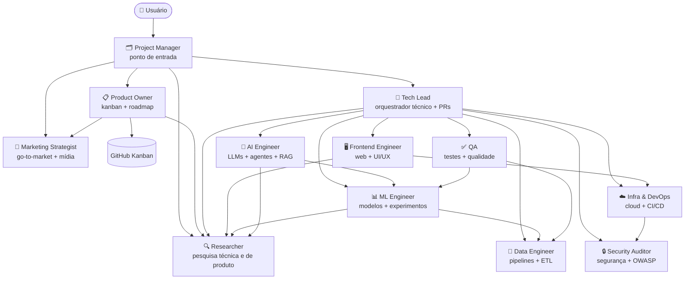

# Claude Code Enterprise Template — Visão da Equipe

Este repositório é a **fábrica de projetos enterprise**. Os agentes aqui são os do template pai — não os dos projetos filhos.

## Agentes do template pai (`.claude/agents/`)

| Agente | Papel |
|---|---|
| `template-coordinator` | Ponto de entrada — orienta o uso do `/wizard`, coordena melhorias no template |
| `tech-lead` | Revisão técnica de PRs no próprio template |

## Agentes do projeto filho (`scripts/templates/agents/`)

Estes 12 agentes são copiados para o filho pelo `new_repo.py` durante a criação:

| Agente | Responsabilidade |
|---|---|
| `project-manager` | Ponto de entrada — delega, consolida, nunca executa |
| `tech-lead` | Orquestrador técnico, code review, aprovação de PRs |
| `product-owner` | Kanban, backlog completo (6 dimensões), priorização |
| `data-engineer` | Pipelines, ETL, qualidade de dados |
| `ml-engineer` | Modelos, features, experimentos |
| `ai-engineer` | LLMs, agentes, RAG, evals |
| `infra-devops` | Cloud, CI/CD, containers, observabilidade |
| `qa` | Testes, cobertura, qualidade |
| `researcher` | Pesquisa de mercado, benchmarks, inteligência competitiva |
| `security-auditor` | Segurança, vulnerabilidades, OWASP |
| `frontend-engineer` | Web, UI/UX, acessibilidade |
| `marketing-strategist` | Go-to-market, posicionamento, campanhas |

## Commands do template pai

| Command | Propósito |
|---|---|
| `/wizard` | Criar novo projeto filho enterprise |
| `/sync-to-projects` | Propagar mudanças do template para projetos filhos |
| `/sync-to-template` | Trazer melhorias de um filho de volta ao template |

## Arquitetura do projeto filho

## Interações entre agentes (filho)

| Agente | Responde a | Trabalha com |
|---|---|---|
| `project-manager` | Usuário | product-owner, tech-lead, researcher, marketing-strategist |
| `product-owner` | project-manager | researcher, marketing-strategist, kanban |
| `tech-lead` | project-manager | data-engineer, ml-engineer, ai-engineer, infra-devops, qa, security-auditor, frontend-engineer, researcher |
| `researcher` | PM / PO / TL (quem acionar) | todos que precisam de inteligência de mercado ou técnica |
| `marketing-strategist` | PM / PO (quem acionar) | researcher |
| `data-engineer` | tech-lead | researcher, qa |
| `ml-engineer` | tech-lead | data-engineer, researcher |
| `ai-engineer` | tech-lead | researcher, ml-engineer |
| `infra-devops` | tech-lead | security-auditor |
| `frontend-engineer` | tech-lead | infra-devops, researcher |
| `qa` | tech-lead | data-engineer, ml-engineer |
| `security-auditor` | tech-lead / infra-devops | infra-devops |

## Contexto obrigatório antes de agir (filho)

**`project-manager` e `tech-lead`** leem, nesta ordem:

1. `.claude/memory/MEMORY.md` — índice da memória persistente
2. `.claude/memory/project_genesis.md` — motivação, decisões de produto, exclusões
3. `.claude/memory/user_profile.md` — perfil e preferências do fundador
4. `.claude/memory/project_history.md` — changelog humano do projeto, cronológico reverso
5. `docs/kickoff/kickoff.md` — visão e backlog aprovados
6. `git log --oneline -10` — últimos commits

**Todos os demais agentes** leem apenas:

1. `docs/kickoff/kickoff.md` — visão e backlog aprovados
2. `git log --oneline -10` — últimos commits

Os arquivos de memória são criados na **Fase 0 do `/kickoff`** e atualizados pelo `project-manager` conforme o projeto evolui. Se algum arquivo contradisser a instrução recebida, o agente **pára e reporta** — não resolve silenciosamente.

## Kanban e GitHub Project (filho)

- Toda issue é **vinculada ao Project** no momento da criação (`gh project item-add`) — sem isso não aparece no board.
- Labels (status + dimensão + prioridade) são pré-criadas no `setup-kanban.yml`.
- Nenhum entregável é produzido sem issue aberta em "In Progress".
- Especialistas movem o próprio card: `In Progress` ao iniciar, `In Review` ao concluir.
- Especialistas **nunca criam issues** — se perceberem lacuna no backlog, sinalizam ao PM/PO no relatório de entrega.

## Versionamento e geração de documentos (filho)

- Entregáveis em `docs/` seguem `{nome}_YYYY-MM-DD_v{N}.md`. Ao revisar, o agente move o anterior para `archive/` e grava `_v{N+1}.md` — **nunca sobrescreve**.
- MDs ganham contraparte em PDF/DOCX/PPTX via `node scripts/generate_docs.js` (saída em `docs//generated/`).

## Como Acionar Agentes (filho)

O `project-manager` delega via `Task` tool. Exemplo:

> "Invoque o `tech-lead` para executar a issue #5"

Os agentes só são acionados dentro de um `/comando` ativo. Fora de comando, o project-manager apenas conversa.

## Como criar um projeto filho

Use o `/wizard` em uma conversa nova **neste repositório**.
