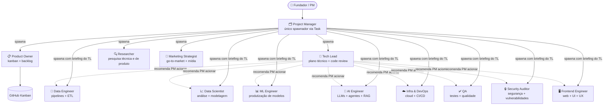

# Equipe de Agentes

Este projeto usa uma equipe de 13 agentes especializados. O ponto de entrada padrão é o `project-manager`.

## Time

| Agente | Responsabilidade |
|---|---|
| `project-manager` | Ponto de entrada — delega, consolida resultados, apresentações e relatórios |
| `tech-lead` | Orquestrador técnico, code review, dono da documentação técnica |
| `product-owner` | Kanban, backlog, roadmap, priorização |
| `data-engineer` | Pipelines, ETL, qualidade de dados |
| `data-scientist` | Análise exploratória, contexto estatístico, insights para editorial e produto |
| `ml-engineer` | Modelos, features, experimentos |
| `ai-engineer` | LLMs, agentes, RAG, evals |
| `infra-devops` | Cloud, CI/CD, containers |
| `qa` | Testes unitários, integração, e2e |
| `researcher` | Pesquisa técnica e de produto, benchmarks, inteligência competitiva |
| `security-auditor` | Segurança, vulnerabilidades |
| `frontend-engineer` | Web, UI, UX |
| `marketing-strategist` | Marketing, go-to-market, canais, publicidade, mídias |

## Arquitetura

O `project-manager` é o **único agente do time com acesso à Task tool** (limitação do Claude Agent SDK: subagentes não spawnam subagentes). Todo spawn de especialista — inclusive os técnicos sob autoridade do `tech-lead` — passa pelo PM. As setas abaixo representam **autoridade técnica e fluxo de briefing**, não a cadeia de spawn (que é sempre PM → especialista).



**Como ler:** setas sólidas (`-->|spawna|`) mostram quem o PM aciona via Task. Setas tracejadas (`-.->|recomenda PM acionar|`) mostram a recomendação técnica do `tech-lead` no plano de execução — o spawn em si é sempre feito pelo PM.

## Contexto obrigatório antes de agir

**`project-manager` e `product-owner`** leem, nesta ordem:

1. `.claude/memory/MEMORY.md` — índice da memória persistente
2. `.claude/memory/user_profile.md` — trajetória, preferências e objetivos do fundador
3. `.claude/memory/project_genesis.md` — motivação fundadora, ancoragens estratégicas, exclusões
4. `.claude/memory/project_history.md` — changelog humano — decisões, entregáveis, restrições
5. Estado do Kanban via `gh project item-list`
6. `git log --oneline -10` — últimos commits

**`tech-lead`** lê:

1. `.claude/memory/MEMORY.md` — índice da memória persistente (inclui referências a guidelines do projeto)
2. `.claude/memory/project_genesis.md` — contexto do projeto
3. `docs/kickoff/kickoff.md` (se existir) — problem statement e backlog aprovados
4. `git log --oneline -10` — últimos commits

**Todos os demais agentes** leem apenas:

1. `git log --oneline -10` — últimos commits

Os arquivos de memória são criados na **Fase 0 do `/kickoff`** e atualizados via `/update-memory`. Se algum arquivo contradisser a instrução recebida, o agente **pára e reporta** — não resolve silenciosamente.

## Kanban e GitHub Project

- Toda issue é **vinculada ao Project** no momento da criação (`gh project item-add`) — sem isso não aparece no board.
- Labels (dimensão + prioridade) são pré-criadas no `setup-kanban.yml`.
- Nenhum entregável é produzido sem issue aberta em "In Progress".
- Especialistas movem o próprio card: `In Progress` ao iniciar, `In Review` ao concluir.
- Especialistas **nunca criam issues** — se perceberem lacuna no backlog, sinalizam ao product-owner no relatório de entrega.

## Fluxo de Kanban

| Papel | Agente | Permissões |
|---|---|---|
| Dono | `product-owner` | cria, fecha, move qualquer card, árbitro final |
| Leitor obrigatório | `project-manager` | lê o kanban antes de toda delegação |
| Criador de issues | `project-manager`, `product-owner` | abrem issues novas |
| Atualizador | todos os especialistas | move o próprio card para `In Progress` e `In Review` |
| Fechador | `product-owner` + `tech-lead` | movem para `Done` após aprovação |

## Fluxo de Código e PR

| Etapa | Responsável |
|---|---|
| Escrever código | agente especialista da tarefa |
| Abrir PR | agente especialista que implementou |
| Code review | `tech-lead` — sempre |
| Security review | `security-auditor` — PRs com infra, auth ou dados sensíveis |
| QA review | `qa` — valida cobertura de testes |
| Aprovar PR | `tech-lead` |
| Merge | `tech-lead`; `infra-devops` em PRs de CI/CD quando delegado |
| Fechar issue | `product-owner` após merge |

Regra central: **nenhum agente faz merge do próprio trabalho sem aprovação do `tech-lead`**.

## Fluxo de Aprovação por Tipo de Artefato

| Tipo de artefato | Exemplos | Revisão e aprovação |
|---|---|---|
| Código | PRs de feature, fix, infra | `tech-lead` |
| Docs internos | pitch, personas, roadmap, arquitetura | `project-manager` |
| Copy / editorial | texto de slide, legenda, narrativa | `project-manager` + `product-owner` |
| Artefato de publicação | PDF público, post em mídia, apresentação externa | `marketing-strategist` valida e publica; escala para `tech-lead` se bug de renderização |

Regra central: **artefatos que saem da organização passam obrigatoriamente pelo `marketing-strategist` antes da publicação**.

## Arquitetura Dual Multi-Agent System

Este framework opera em dois mundos:
- **Mundo 1 — Sistema agentic (raiz):** infraestrutura do framework — `.claude/`, `CLAUDE.md`, `AGENTS.md`, `pyproject.toml`, `docs/` (do sistema), hooks, geradores universais, CI. Estrutura rígida herdada do enterprise-template. Commits com escopo `(system)`.
- **Mundo 2 — Produtos (`products/<produto>/`):** estrutura livre por produto. Inclui **código** (scripts/src/tests do produto), não só documentos. Commits sem escopo ou com escopo do produto.

Os 13 agentes alternam entre os dois mundos. Em Mundo 1 valem as regras de sistema (versionamento documental, estrutura por agente em `docs/`, frontmatter YAML obrigatório). Em Mundo 2 a forma é definida pelo produto.

**Atenção — `scripts/`, `src/`, `tests/` na raiz NÃO são genéricos.** Só recebem código do framework agentic (CI, hooks, libs universais reutilizáveis por múltiplos produtos). Código que existe **por causa de um produto específico** vai em `products/<produto>/scripts/` ou `products/<produto>/src/` — mesmo que apenas um produto exista hoje. A pasta `products/` recebe não só docs e briefings, mas também todo o código do produto.

**Regra de desempate (critério do leitor primário):** vale para **qualquer arquivo** do repo — `.md`, `.py`, `.sh`, `.yaml`, módulo, script, teste, dado. Pergunte *quem lê/consome esse arquivo de forma recorrente?* Se é o operador/consumidor de um produto específico (ou código que serve apenas àquele produto), vai para `products/<produto>/`. Se é o time que mantém o sistema agentic (ou código universal reutilizável por qualquer produto), vai para Mundo 1. **Quem escreve não define onde mora; quem lê/consome define.** Teste prático para código: se você deletasse o produto X amanhã, o arquivo continuaria fazendo sentido? Sim → sistema. Não → produto.

**Subníveis dentro de produto:** comece no nível mais específico (pasta da rotina) e promova quando aparecer segundo consumidor (raiz do produto compartilha entre rotinas). Detalhes e exemplos em `CLAUDE.md` §"Regra de fronteira" e §"Subníveis dentro de produto".

## Estrutura de `docs/` por agente

Cada agente escreve **apenas em sua própria pasta**:
- `docs/business/<agente>/` para agentes de negócio: `product-owner`, `marketing-strategist`, `researcher`, `project-manager`
- `docs/tech/<agente>/` para agentes técnicos: `tech-lead`, `data-engineer`, `data-scientist`, `ml-engineer`, `ai-engineer`, `frontend-engineer`, `infra-devops`, `qa`, `security-auditor`

## Frontmatter YAML em todo .md de `docs/`

```yaml
---
title: <título>
authors:
  - <agent-slug>
created: YYYY-MM-DD
updated: YYYY-MM-DD
---
```

`authors` é lista cronológica (quem cria entra primeiro; quem revisa e nunca apareceu, anexa-se ao final; quem revisa algo que já assina, não muda nada). `created` é imutável. `updated` é atualizado a cada revisão.

## Versionamento e geração de documentos

- Entregáveis versionáveis (em `docs/`, `products/<produto>/`, etc.) usam **nome estável** no vigente: `{nome}.md`. Ao revisar, o agente move o anterior para `archive/{nome}_${TODAY}_v${N}.md` (a data é `date +%Y-%m-%d` do arquivamento — não da criação da versão; `N` = última versão arquivada + 1) e recria `{nome}.md` com o conteúdo novo. **Nunca sobrescreve**, e referenciadores nunca quebram.
- MDs ganham contraparte em PDF/DOCX/PPTX via `node scripts/generate_docs.js` (saída em `docs/<sub>/generated/`, espelhando a estrutura, inclusive `archive/`).

## Como Acionar Agentes

Apenas o `project-manager` tem acesso à `Task` tool. Os demais agentes (incluindo o `tech-lead`) não podem spawnar subagentes — quando precisam de outro especialista, retornam ao PM um plano ou recomendação, e o PM faz o spawn.

Para tarefa técnica, o fluxo é:

> 1. PM spawna `tech-lead`
> 2. `tech-lead` retorna **plano de execução** (especialistas, briefing, ordem)
> 3. PM spawna cada especialista listado, com o briefing que veio do `tech-lead`

Exemplo direto (apenas após o plano técnico do TL):

> "Invoque o `data-engineer` para executar a issue #14, com briefing técnico definido pelo tech-lead"

Os agentes só são acionados dentro de um `/comando` ativo. Fora de comando, o project-manager apenas conversa.
